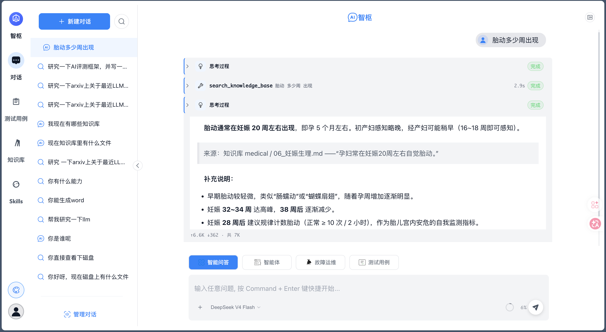
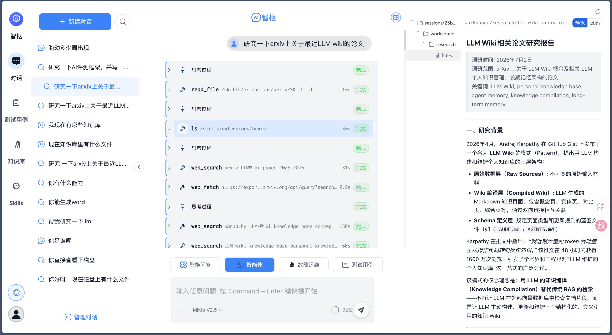
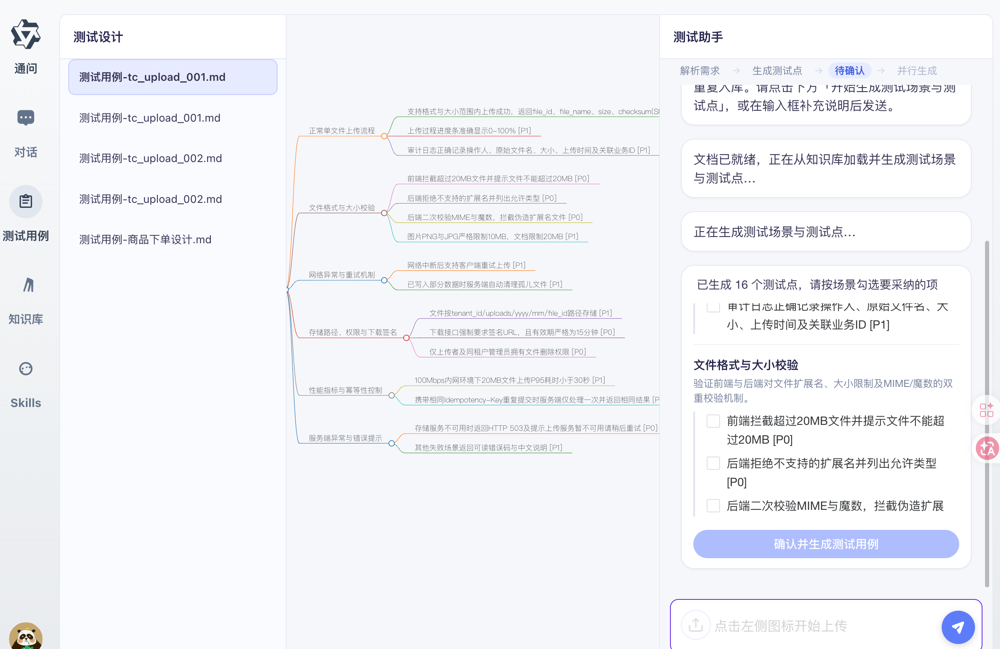

# Noesis（智枢）

Noesis 是一个基于 **Vue 3 + FastAPI + LangGraph** 的全栈 AI 对话平台，面向多场景智能体协作：通用问答、故障运维、深度研究与测试用例生成。前端通过 SSE 流式展示推理与工具调用过程；后端统一 Agent 运行时、知识库 RAG 检索、AIO 沙箱与消息持久化。

## 核心能力

| 场景 | Agent | 工具来源 | 说明 |
|------|-------|---------|------|
| 智能问答 | GeneralQAAgent | RAG hybrid 检索 + 联网搜索 | 知识库增强的多轮对话，支持附件上传与引用溯源 |
| 智能体 | SuperAgent | 文件系统 + Skills + 联网检索 | 自主调研、多步任务编排与报告产出（原深度研究） |
| 故障运维 | FaultOperationAgent | MCP（读文件、执行命令、查日志等） | 通过 MCP 连接运维工具，多步推理定位根因 |
| 测试用例生成 | CaseCoordinator | LangGraph 自定义工作流 | 分阶段生成测试场景与测试点，脑图可视化与人工确认 |

## 功能演示

### 智能问答

基于 RAG 混合检索（向量 + 关键词）与精排，结合知识库精准作答；支持多轮上下文、会话附件与流式推理展示。



### 智能体（深度研究）

Agent 自主加载 Skills、在沙箱工作区创建研究目录、联网检索，并通过 SSE 流式展示推理与工具调用过程。



### 测试用例生成

基于需求文档分阶段生成测试场景与测试点，支持脑图可视化与人工勾选确认后批量产出用例。



## 平台能力

除对话场景外，Noesis 还提供以下配套能力：

| 模块 | 说明 |
|------|------|
| **知识库** | 文档上传、DeepDoc 解析、分块入库；hybrid 检索 + rerank；集合级处理/查询参数配置 |
| **Skills 管理** | 自定义 Agent Skills 包，深度研究/智能体场景以 `/skills/` 虚拟路径只读挂载 |
| **MCP 客户端** | 独立页面调试 MCP 服务连接与工具调用 |
| **会话管理** | 多会话历史、按 `qa_type` 分类、流式中断（stop token）与断连恢复 |
| **模型目录** | `config.yaml` 配置多模型目录，前端会话级切换 |
| **可观测性** | 可选接入 Langfuse 追踪 Agent 调用链 |

## 技术栈

| 层级 | 技术 |
|------|------|
| 前端 | Vue 3、Vite、TypeScript、Naive UI、Pinia、UnoCSS |
| 后端 | FastAPI、LangChain、LangGraph、SQLAlchemy（异步） |
| 存储 | PostgreSQL（业务数据与 LangGraph checkpoint）、Qdrant（向量检索） |
| 模型 | DashScope（Qwen）/ OpenAI 兼容接口；Embedding + Rerank + VLM |
| 沙箱 | Docker Exec（`sandbox-slim` + `sandbox-runner`）；开发可用 `local_shell` |
| 扩展 | `extensions/skills`（Skills 包）、`extensions/mcp`（MCP 服务） |

## 架构概览

```
┌──────────── 前端（Vue 3）────────────────────────────────────┐
│  对话 · 知识库 · Skills · MCP 客户端 · 测试用例生成          │
└────────────────────────┬─────────────────────────────────────┘
                         │ SSE / REST
┌────────────────────────▼─────────────────────────────────────┐
│  后端（FastAPI + LangGraph）                                    │
│  问答编排 · Agent 工厂 · KB 检索 · 消息持久化 · 沙箱编排       │
└────────────┬──────────────────────┬──────────────────────────┘
             │                      │
        PostgreSQL（业务数据）    Qdrant（向量库）
             │
        .data/（checkpoint、用户工作区、附件、KB 缓存）
```

**Agent 运行时路径约定**（沙箱内虚拟路径）：

| 路径 | 用途 |
|------|------|
| `/`（工作区根） | 当前会话默认可写区（如 `/diagram.md`、`/outputs/`） |
| `/research/` | 深度调研等 research 场景的可选子目录 |
| `/memory/` | 用户级持久记忆 |
| `/skills/public/` | 内置 Skills（只读） |
| `/skills/personal/` | 用户自定义 Skills（只读；同名覆盖 public） |

## 快速开始

### 前置条件

| 依赖 | 版本 / 说明 |
|------|------------|
| Node.js | 18+ |
| pnpm | 9.x |
| Python | 3.11+，包管理使用 [uv](https://github.com/astral-sh/uv) |
| Docker | 本地开发用于 Qdrant 与 AIO 沙箱；生产推荐 Compose 部署 |
| PostgreSQL | 17+，需创建业务数据库与 LangGraph checkpoint 数据库（见下方初始化） |

### 一键启动

```bash
# 克隆后，一键本地开发（Qdrant + 后端热重载 + 前端 :2048）
./scripts/run.sh dev
```

首次运行若缺少配置文件，脚本会从模板生成 `backend/.env` 与 `backend/config.yaml`，按提示修改后重新执行。

### 配置要点

1. **敏感项**（`backend/.env`，从 `.env.example` 复制）：

   | 变量 | 说明 |
   |------|------|
   | `POSTGRES_PASSWORD` | PostgreSQL 密码 |
   | `MODEL_API_KEY` | LLM API Key（默认 DashScope） |
   | `EMBEDDING_MODEL_API_KEY` | Embedding / Rerank API Key |
   | `VLM_MODEL_API_KEY` | 视觉模型 API Key（附件识图） |

2. **运行参数**（`backend/config.yaml`，从 `config.example.yaml` 复制）：模型名称、数据库连接、Qdrant、Session 空闲/绝对有效期和沙箱配置等。生产环境必须以同源 HTTPS 部署，认证 Cookie 由服务端管理；浏览器页面被回收后会通过 Cookie 自动恢复会话。

3. **初始化数据库**：

   ```bash
   cd backend
   uv run python sql/initialize_postgresql.py   # 建库 + 迁移 + 演示账号
   ```

   演示账号：`admin` / `123456`（部署后请修改密码）。

4. **（可选）联网检索**：配置 `TAVILY_API_KEY`；未配置时自动回退 DuckDuckGo 搜索。

### 访问地址（dev 模式）

| 服务 | 地址 |
|------|------|
| 前端 | http://127.0.0.1:2048 |
| 后端 API | http://127.0.0.1:8089 |
| Qdrant Dashboard | http://127.0.0.1:6333/dashboard |

### 其他启动方式

```bash
./scripts/run.sh help          # 查看 dev / prod / docker 说明
./scripts/run.sh prod          # 裸机生产形态验收
./scripts/run.sh docker        # Docker Compose（nginx + backend + qdrant + sandbox-runner）
START_MCP=1 ./scripts/run.sh dev   # 本地开发并启动 extensions/mcp/ssh（故障运维）
START_LANGFUSE=1 ./scripts/run.sh dev   # 同时启动 Langfuse 观测栈
```

仅启动单端时：

```bash
cd frontend && pnpm i && pnpm dev    # http://localhost:2048
cd backend && uv run app.py          # 验证后端能否拉起
```

## 仓库结构

```
Noesis/
├── frontend/          # Vue 3 前端
├── backend/           # FastAPI + LangGraph 后端
├── extensions/        # Skills 包 + MCP 服务
├── deploy/            # Docker Compose、镜像定义、生产配置
├── scripts/           # run.sh（dev | prod | docker）
├── assets/            # README 演示截图
├── openspec/          # 变更提案与规格
└── docs/              # PRD、Bug 记录、调试笔记
```

## 文档索引

| 文档 | 内容 |
|------|------|
| **本文件** `README.md` | 项目介绍、演示、快速开始 |
| [AGENTS.md](AGENTS.md) | 仓库导航、跨端约定、协作与 Bug 流转 |
| [frontend/AGENTS.md](frontend/AGENTS.md) | 前端目录地图、命令、流式/UI 约定 |
| [backend/AGENTS.md](backend/AGENTS.md) | 后端分层规范、配置、开发流程 |
| [extensions/README.md](extensions/README.md) | Skills 与 MCP 扩展说明 |
| [deploy/README.md](deploy/README.md) | 容器部署与远程发布 |
| [backend/sql/README.md](backend/sql/README.md) | 数据库迁移（Alembic） |
| `./scripts/run.sh help` | 部署模式、端口与环境变量 |
| `docs/` | PRD、Bug 记录、调试笔记 |

## 开发

```bash
cd backend && uv run app.py              # 后端改动后验证能否拉起
cd backend && uv run pytest tests/ -q    # 后端测试
cd frontend && pnpm lint                 # 前端 lint
```

- Python 统一使用 `uv run`，禁止裸 `python`
- 依赖链：`API → Service → Domain / Agent`；API 禁止直连数据库
- SSE、Agent、Qdrant、消息持久化相关改动优先补回归测试

## 可选能力

### Langfuse 观测

设置以下环境变量即可启用 Agent 追踪（未配置时不影响正常运行）：

- `LANGFUSE_PUBLIC_KEY`
- `LANGFUSE_SECRET_KEY`
- `LANGFUSE_HOST`
- `LANGFUSE_ENABLED=true`

自托管部署可参考 [Langfuse 官方文档](https://langfuse.com/docs/deployment/self-host)，或通过 `START_LANGFUSE=1 ./scripts/run.sh dev` 启动本地栈。

### 故障运维 MCP

故障运维场景需启动 MCP 服务（宿主机 `ssh` 客户端，无需额外 Docker 镜像）：

```bash
START_MCP=1 ./scripts/run.sh dev
```

MCP 配置见 `extensions/mcp/mcp.json`，可用 `other.mcp_config_path` 或环境变量 `MCP_CONFIG_PATH` 覆盖。
