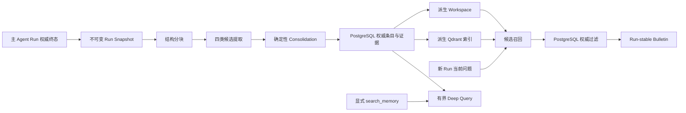

# Agent Memory

Noesis 只有一套自动记忆方案：Run-aware Memory Cortex。它从主 Agent Run 的权威终态提取可复用结论，在后续新 Run 中提供短 Bulletin 或显式只读查询。旧 Dream、`memory/YYYY-MM-DD.md`、L2 搜索、failure-only extraction 和 action card 已删除。

`USER.md` 与 `AGENTS.md` 仍由用户显式维护，不属于自动记忆流水线。

## 用户能力

- 设置页只有一个“经验记忆”开关，默认关闭。
- 开启后，系统整理此后完成的有效 Run，并允许自动 Bulletin 注入。
- 关闭后，不 capture、不整理、不自动注入，也不补写关闭期间历史；已有条目仍可查看、搜索、修订、禁用、失效或删除。
- 用户可以查看 `decision|experience|workflow|gotcha` 四类条目及证据来源。
- 用户修订始终生成新版本，原版本进入历史；用户明确纠正的优先级高于后续自动观察。

不存在部署级功能开关，也不存在分别控制提取和注入的双开关。运维只负责迁移数据库、运行同一个 worker 和恢复派生视图。

## 数据流

### 1. Capture

只在根 Run 进入 `completed|partial|error|interrupted` 权威终态后创建 job。`hitl_pending`、无有效工作的取消、subagent、内部记忆 Run 不 capture。同一 `run_id` 只有一份 snapshot 和一个 job，因此 HITL resume 不会重复整理。

Snapshot 收集用户目标与纠正、assistant 可见结论、终态工具结果、产物摘要、验证结果、compaction span 和本 Run 已召回的 memory ids。它排除 system、reasoning、重复 SSE、记忆工具输出和内部整理内容。敏感值先脱敏；外部网页、MCP 或命令内容会把衍生结论标为低信任。

### 2. Chunk 与 Extract

分块遵循语义边界：用户纠正、assistant decision、tool+outcome、artifact+validation、compaction。超大输出只保留结构化 outcome、有界摘录、digest 和来源指针，不截出半个 message 或 JSON。

Extractor 只能产生四类严格 schema candidate，并引用当前 snapshot 中真实存在的 source span。无价值 Run 可以正常得到 `succeeded_no_output`；单个 chunk 失败只重试该 chunk，已成功结果持久化复用。模型异常按安全类别记录并在重试间指数 backoff；包含用户 goal/correction 与内部 validation 的高信号 chunk 若首轮为空，会做一次 targeted recheck，重查仍为空则视为已确认 no-output，不触发无意义 dead-job 重试。代码还会把带 ordered steps、validation 和 stop rule 的 procedure 确定性归为 workflow，避免因“用户明确选择”误标 decision。

### 3. Consolidation

权威身份是 `(user_id, scope_key, memory_type, subject_key)`。首版不让自由模型决定覆盖关系，只使用有界邻居、来源信任和受限操作：`ADD|REINFORCE|UPDATE|SUPERSEDE|CONTRADICT|NOOP`。

- 相同结论增加独立 evidence，不重复建条目。
- 明确用户纠正可以更新当前结论。
- 没有明确纠正的冲突进入 `needs_review`，不能静默覆盖。
- 非 Git 的自动 global 候选默认保持 `candidate`，需用户确认后才能 active。
- 外部命令内容形成的候选不能自动 active。
- `disabled` 与 `invalidated` 不会被后台自动恢复。

状态为 `candidate|active|needs_review|superseded|disabled|invalidated`。只有符合 scope、有效期、来源和证据门槛的 active 条目可自动注入。

### 4. 派生视图

PostgreSQL 是唯一事实源。服务端在 `.noesis/memory-workspaces/{user}/{scope_digest}` 原子生成 manifest、摘要、四类文档和受限 Run 摘要；它不写项目仓库，也不接受文件反向写入。

Qdrant collection `noesis_memory` 仅用于语义候选召回。outbox 消费者每次重读 PostgreSQL desired state：active upsert，其它状态或不存在则 delete。重复、迟到和乱序事件都会收敛；collection 丢失时可以全量重建。

## 读取与注入

### Fast Bulletin

每个新 Run 使用 manifest/lexical/semantic 合并召回，再由 PostgreSQL 校验 user、project/profile scope、status、validity、provenance 和 evidence。任何依赖失败都返回零自动注入，主任务继续执行。

Bulletin 不调用额外生成模型，只包含结论、适用范围、验证状态和 memory id，总预算不超过 500 tokens。candidate、needs_review、history、跨项目、未确认 global、低信任命令和 raw evidence 均不可自动注入。

### Deep Query

`search_memory` 与 `get_memory_source` 是显式只读工具。查询限制 user/scope、steps、timeout、spans、tokens 和并发，不可使用网络、shell、业务写工具或外部 MCP。输出区分 `exact|near|contradicts|insufficient|unavailable`，证据不足时明确 abstain。

## 上下文 Cache

Prompt 顺序固定为：稳定 system/developer/tool/history prefix → 单一动态 Bulletin → 当前 HumanMessage。动态上下文不再修改 system prompt，避免一次性内容污染稳定前缀。

Bulletin 使用 canonical serializer：固定排序、字段、空白和转义；排除当前时间、run id、source span、证据数、last verified 和随机值。同一 Run（包括 HITL 跨进程恢复）冻结 text/hash；新 Run 重新检索。相同内容保持相同 hash，内容变化才改变 hash。subagent 不继承 Bulletin 或记忆工具。

模型适配层区分自动 prefix cache、需要显式 breakpoint 和不支持 prompt cache 三种 capability。需要显式 breakpoint 时只能标记稳定 system/developer/tool/history 前缀末端；Bulletin、当前时间、当前用户输入和 tool result 不得进入稳定缓存段，也不提供额外用户开关。

观测同时记录 cache read、cache write、uncached input、可用性和 TTFT。provider 没有返回 cache 明细时记为 unavailable，不能按零命中处理。评测必须分别覆盖：同 Run、新 Run同 Bulletin、新 Run变化 Bulletin、Deep Query tool result 四种场景。

## 后台可靠性与保留

一个 worker 处理 capture/extract/consolidate 和 workspace/index outbox。job/outbox 共用 `SKIP LOCKED`、attempts-on-claim、lease、heartbeat、claim token、stage timeout 和 fencing。旧 worker 失去 lease 后不能提交；达到最大尝试次数进入 dead。

阶段结果持久化，崩溃后从最后完成阶段继续。关闭用户开关后，各阶段再次检查 preference 并转为 `skipped_disabled`。过期 snapshot、终态 job/outbox 按配置清理；账户删除同时删除 PostgreSQL 数据和服务端 workspace，派生索引按 desired state 删除或重建。

## Scope 与安全边界

Git remote 规范化后生成 origin digest；没有 remote 时使用 Git realpath digest；非 Git 使用受限 global scope。凭据、transport 差异和服务端绝对路径不进入 scope 或用户可见来源。

自动记忆不能扩大 Agent 权限。外部内容只能作为低信任 evidence，不能变成指令；召回到当前 Run 的 memory id 会写入 snapshot 并从新候选证据中排除，防止记忆自我强化。

## 评测与上线门槛

离线评测位于 `backend/evals/memory_cortex/`。结构测试默认使用冻结 fixture/fake，不访问真实模型；它只能验证管线契约，不能证明上线效果。

可启用状态还必须通过：分层 extraction/consolidation 指标、retrieval/Bulletin 指标、跨用户/项目与 stale/disabled 等零容忍安全项、冻结任务集 paired memory-on/off、四类 cache 场景。报告固定模型、embedding、prompt/schema、seed、成本和 95% CI；test 后不能调参重报。live extraction 将 provider 暂态失败与模型空结果分开；只允许在相同代码/config/实际模型指纹下续跑 failed fixtures，成功 observations、原始 `created_at` 和 Gold 不得改写，跨指纹或跨模型报告禁止 resume。

## 部署与回滚

部署顺序：执行 migration → 启动单 worker → 重建派生 workspace/index → 仅给测试用户手动开启 → 跑完整 release gate。默认 preference 为关闭，不做历史 backfill。

回滚优先由用户关闭“经验记忆”；服务故障时可停止 worker。事实表保留不会影响聊天、`USER.md` 或 `AGENTS.md`。派生 workspace 与 Qdrant 可随时删除并从 PostgreSQL 重建。
