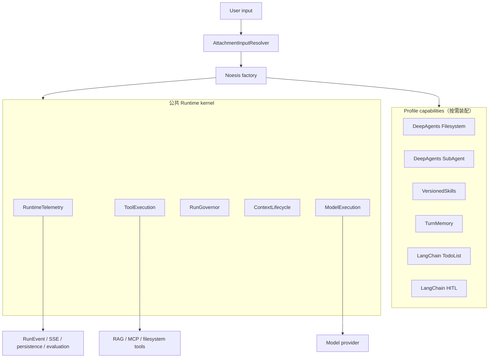
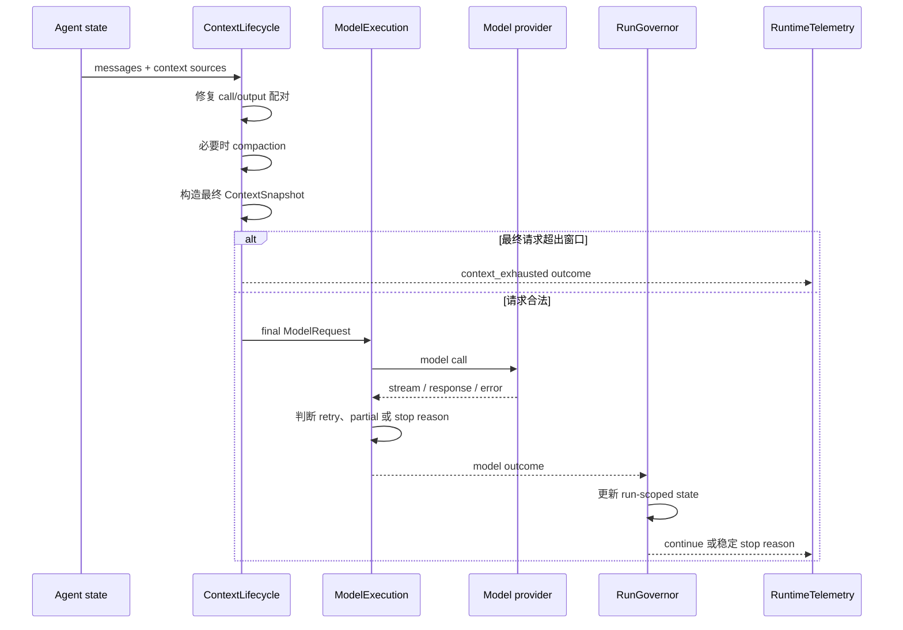

# Noesis Agent Runtime 设计

> 状态：Current  
> 关联 OpenSpec：[`converge-agent-runtime`](../../../openspec/changes/converge-agent-runtime/)  
> 研究依据：[`Codex Agent Runtime 对 Noesis 的启示`](../../research/agents/codex-agent-runtime-lessons.md)

## 1. 为什么要调整 Runtime

Noesis 已经通过统一 factory 创建 Agent。当前问题不是 Agent 各自运行，而是同一次运行中的状态由过多 middleware 分别决定：

- context token 在摘要、预算保护和指标统计中重复计算；
- dangling tool call、compaction 和 context overflow 属于同一条模型请求链，却由不同组件处理；
- loop detection、tool call limit 和子 Agent 限制分别计数；
- model retry 只处理异常，无法统一表达 length、safety、partial output 和工具后空响应；
- 工具大结果进入 history 后，直到 context 接近上限才被摘要逻辑处理。

这些组件单独看都有合理职责，但组合后很难回答三个关键问题：

1. 当前 run 为什么继续、重试或停止？
2. 最终发送给模型的 context 到底由谁构造和计量？
3. 线上运行、子 Agent 和离线评测是否使用同一套行为？

新设计不重写 LangChain/LangGraph Agent loop，而是在公开 middleware hook 上建立五个明确的 runtime owner。每类状态只由一个 owner 决定，其余组件只提供计算或存储能力。

## 2. 设计边界

### 2.1 Runtime kernel 负责什么

公共 kernel 负责所有 ReAct Agent 都需要的运行控制：

- 构造、规范化、压缩和校验模型上下文；
- 执行模型调用，判断重试与终止结果；
- 归一工具结果，并保证写入 history 的内容有界；
- 管理一次 run 内的模型、工具和子 Agent 预算；
- 把运行结果转换成统一的观测事件。

### 2.2 Profile capability 负责什么

Filesystem、SubAgent、Skills、Memory、Todo 和 HITL 是按 Agent 场景选择的能力，不属于公共 guard。COMMON_QA 不应因为使用公共 runtime 就加载 SuperAgent 的能力。

附件也不是 middleware。它只在新一轮调用 Agent 前，把数据库附件解析成最终 HumanMessage。HITL resume 使用 `Command(resume=...)`，不会再次注入附件。

### 2.3 本次不做什么

- 不实现 Noesis 自有的第二套 ReAct loop；
- 不照搬 DeerFlow 的完整 middleware 清单；
- 不新增通用 ToolPolicy、ReadBeforeWrite 或全局文本转义 middleware；
- 不在本次变更重新实现 token attribution；
- 不让 CaseCoordinator 改走 ReAct runtime。

## 3. 整体结构



线上 Agent、子 Agent 和 Harbor 等离线评测必须经过同一个 factory/runner。评测 adapter 可以收集结果，但不能自行实现 retry、compaction、tool bounding 或 run budget。

## 4. 五个 Runtime Owner

| Owner | 负责 | 不负责 |
|---|---|---|
| `ContextLifecycleMiddleware` | history 规范化、context source 组装、预算判断、compaction、最终 snapshot | Provider 重试、run 总预算 |
| `ModelExecutionMiddleware` | 单次模型调用、retry 边界、finish reason、partial/empty 结果 | history 压缩、工具执行 |
| `ToolExecutionMiddleware` | 工具失败分类、结果 envelope、无 backend 时的有界 fallback | 文件权限、HITL、第二套 artifact 存储 |
| `RunGovernorMiddleware` | model/tool/subagent 计数、循环和 run 级停止原因 | context token 估算、事件展示 |
| `RuntimeTelemetryMiddleware` | 读取 outcome，输出 trace/event/usage | 改变继续、重试或停止决策 |

Middleware 只是 LangChain lifecycle 的入口。token estimator、compaction service、revision store 等纯计算或存储逻辑放在 `noesis/runtime/`，但不能绕过 owner 直接改变 Agent 控制流。

## 5. Middleware 顺序为什么重要

最终顺序按 outermost 到 innermost 表达：

```text
RuntimeTelemetry
  → ToolExecution
  → Filesystem / SubAgent / AsyncSubAgent / Todo / VersionedSkills / TurnMemory
  → HumanInTheLoop
  → RunGovernor
  → ContextLifecycle
  → ModelExecution
```

这不是按目录或“公共组件在后面”机械拼接，而是由 hook 语义决定：

- `wrap_*` 形成嵌套调用。ToolExecution 位于 Filesystem 外层，才能拿到 Filesystem 已经 offload 的最终 ToolMessage；
- Skills 和 Memory 会修改 model request。它们位于 ContextLifecycle 外层，ContextLifecycle 的内层 `wrap_model_call` 才能看到最终 system prompt；
- `after_*` 逆序执行。Governor 放在 HITL 内侧，使其 model outcome 先完成，再进入外层审批流程；
- ModelExecution 最靠近 Provider，避免重试时重放 context compaction、工具或 HITL 副作用。

必须用契约测试固定当前 LangChain/DeepAgents 版本的实际进入和退出顺序，不能只依赖文档推测。

## 6. 一次 Model Step 如何运行



### 6.1 ContextSnapshot

ContextLifecycle 分成两个 hook 阶段，但仍是一个 owner：

1. `before_model` 基于 Agent state 修复 dangling tool call，并决定是否 compaction；
2. 最内层 `wrap_model_call` 基于 Skills、Memory 等处理后的最终 ModelRequest 构造唯一 `ContextSnapshot`。

Snapshot 至少包含 messages、system/context sources、advertised tools、估算 token、模型窗口和 provenance。Telemetry 只能读取 snapshot，不能重新估算并形成另一套口径。

Compaction 只压缩 conversation history。system prompt、Skills、Memory 和 SessionClock 从权威来源重新加入。附件属于 HumanMessage，不是压缩后重新注入的 context source。

### 6.2 模型重试与终止

模型重试必须同时满足：错误可重试、尚未产生用户可见文本、尚未开始工具或 HITL 副作用。只要任一边界已经发生，就保留已有输出并返回 `partial_output`，不能重放整个 step。

Provider 自身的 sampling retry 默认关闭，避免与 ModelExecution 形成两层重试。摘要等非交互调用可以使用独立的 provider retry。

工具完成后若模型返回空正文且没有新 tool call 或 HITL 请求，ModelExecution 会使用只作用于当前 request 的瞬时提示再调用一次模型。该提示不写入 conversation state，也不重放工具。第二次仍为空时返回固定可见结果，并记录 `empty_after_tools`。

## 7. 工具结果如何有界化

每次工具调用在写入 Agent history 前形成内部 envelope：

```text
ToolResultEnvelope
  tool_call_id / tool_name
  status / category / outcome
  content
  bounded_by: deepagents | noesis_fallback | none
  original_size / omitted_size  # 仅 fallback 能可靠取得时
  timing
```

处理顺序固定为：

```text
invoke
  → failure classification / outcome parsing
  → output bounding
  → ToolMessage + lifecycle event
```

有 session filesystem backend 的 Profile 直接使用 DeepAgents `FilesystemMiddleware`。它负责把大结果写入 `large_tool_results` 并返回有界 ToolMessage。ToolExecution 只把处理后的 content 当作权威结果，不解析第三方提示文本，不创建第二份 artifact，也不再次截断。

没有 backend 的 COMMON_QA、SimpleMCP 等 Profile 由 ToolExecution 执行一次 head/tail fallback。fallback 明确标出省略内容，但不能伪造一个实际不可读取的 artifact 地址。

## 8. Run Governor 如何管理预算

Governor 以 `run_id` 为作用域维护：

```text
model_calls
tool_calls_total / per_tool_window
active_subagents / subagents_total / max_depth
actual_provider_tokens  # attribution 可用时才启用
stop_reason
```

LoopDetection 和 ToolCallLimit 的计数迁入同一份 state。子 Agent 启动前原子预留 active slot；启动失败、完成或中断时释放 active slot，但 total 不回退。子 Agent 可以有更严格的局部限制，但必须继承父 run 的总预算。

累计 token 硬限制只能使用按 model run id 去重后的实际 Provider usage。`add-agent-context-usage-attribution` 尚未完成时，该限制保持关闭；context occupancy 估算不能冒充实际 cost。

恢复运行时，checkpoint 中的累计计数与进程内活跃任务可能不一致。实现需要依据实际 subagent registry 做 reconcile，不能把 checkpoint 中的 active slot 永久当真。

## 9. Skills、Memory 和附件为什么不需要三个特殊 Middleware

### 9.1 VersionedSkills

DeepAgents 已经负责 Skill 扫描、frontmatter 解析、override 和 prompt 注入。Noesis 只增加 `.skills_revision` 缓存失效：revision 未变化时使用 checkpoint 内容；变化时调用 DeepAgents 基类重新加载。

如果上游没有公开 reload hook，可以向父类传入只省略缓存字段的最小 state view，但不能复制 DeepAgents 的扫描和解析代码。该接缝必须由 pinned-version 契约测试保护。

### 9.2 TurnMemory

DeepAgents 会把 `memory_contents` 保存在 checkpoint 中，同一 thread 的后续调用默认继续使用首次缓存。Noesis 需要用户或 Agent 修改 Memory 后在下一条用户消息生效，但不需要同一次任务中的 system prompt 动态变化。

`TurnMemoryMiddleware` 因此只在 `before_agent/abefore_agent` 忽略旧缓存并调用 DeepAgents 加载一次。本轮所有 model call 使用同一份 Memory；本轮写入的新内容到下一次用户 turn 才重新加载。方案不使用 `.memory_revision`，也不要求平台和 Agent 的所有写入口发送通知。

### 9.3 AttachmentInputResolver

附件只影响本轮初始输入，没有持续观察 model/tool lifecycle 的职责。因此 resolver 在调用 Agent 前生成最终 HumanMessage，并通过 runtime dependency port 获取附件，不让 harness 反向依赖平台 ORM。

## 10. Outcome 如何到达前端和评测

所有 owner 使用统一 `RuntimeOutcome`：

```text
phase: model | context | tool | governor
status: continue | retry | stop | error
reason: stable enum
visible_output_started: bool
side_effect_started: bool
retryable: bool
detail: internal-only
```

`detail` 只进入日志和 trace。streaming 层把公开字段映射为现有 RunEvent、SSE 和 assistant 终态：

- retry attempt 使用现有 `run-status=retrying/running`；
- 有正文的停止保存为 `partial`，同时记录稳定 `finish_reason`；
- 没有可用正文的不可恢复错误进入现有 error 终态；
- governor 停止保留之前已经产生的 parts；
- 工具事件继续沿用 `output/status/errorCategory/outcome`。

旧客户端忽略新增 reason 后仍能正常完成消息收尾。Harbor、BrowseComp 和 Agentic RAG 读取同一批 outcome/event，不建立评测专用执行分支。

## 11. Agent Profile 装配

| Profile | Capability | 公共 kernel |
|---|---|---|
| COMMON_QA | 无；附件由 resolver 处理 | 五个 runtime owner |
| SUPER_AGENT_QA | Filesystem、SubAgent、可选 AsyncSubAgent、Todo、可选 HITL、VersionedSkills、TurnMemory | 五个 runtime owner |
| FAULT_OPERATION_QA | Filesystem、SubAgent | 五个 runtime owner |
| SimpleMCP | 无 | 五个 runtime owner |
| Super/Fault 子 Agent | Filesystem、按配置启用 VersionedSkills | 五个 runtime owner，并继承父 Governor |
| TEST_CASE_QA | 现有 CaseCoordinator workflow | 不强制使用 ReAct kernel |

Factory 应提供可枚举的 inventory builder，让测试直接断言每个 Profile 的 middleware 类型、来源和顺序，而不是通过运行结果间接猜测装配是否正确。

## 12. 验证

关键测试包括：

- async hook 能否观察可见 token、tool/HITL 边界和 finish reason；
- before、wrap、after hook 的实际顺序；
- 大 ToolMessage 在有/无 backend 时只处理一次；
- dangling call 修复后 Provider 请求合法；
- compaction 后 Skills、Memory 和 SessionClock 正确恢复；
- 可见输出后断流不会重试；
- 工具后空响应只额外调用模型一次；
- 子 Agent 并发、总量、深度和恢复隔离；
- SSE、assistant persistence 和 Harbor 得到相同 stop reason。

真实模型 E2E 只保留代表性冒烟。边界行为主要使用确定性 fake model、fake tool 和 checkpoint fixture 验证，避免把慢且不稳定的线上调用当作唯一反馈。

## 13. 已知风险

- LangChain 公开 hook 可能无法稳定提供某些 Provider finish reason。必须先用契约测试确认；若确实无法表达，再单独设计薄 runner adapter，不能预先复制整个 Agent loop。
- DeepAgents 可能修改 Skills/Memory cache 字段或 Filesystem offload 文案。Noesis 不解析其提示文本，并用 pinned-version 测试及时发现契约变化。
- middleware 顺序错误不会总是立即报错，却可能让 ContextSnapshot 缺少 Skills/Memory，或者让 ToolExecution看到 offload 前内容。因此 inventory 顺序属于测试契约，不只是代码风格。
- Governor 的 durable counter 与进程内活跃 subagent 状态属于不同生命周期；恢复时保留累计计数，但把无法跨进程存活的 active slot 重置为零。

## 14. 权威来源与维护规则

本文用于解释方案，不替代 OpenSpec：

- 范围和非目标以 [`proposal.md`](../../../openspec/changes/converge-agent-runtime/proposal.md) 为准；
- 技术决策以 [`design.md`](../../../openspec/changes/converge-agent-runtime/design.md) 为准；
- 可验收行为以 change 内 [`specs/`](../../../openspec/changes/converge-agent-runtime/specs/) 为准；
- 实现进度以 [`tasks.md`](../../../openspec/changes/converge-agent-runtime/tasks.md) 为准。

旧版本产生的 `summary_offload/` 仅是工作区历史文件。当前 runtime 不再读取或生成它；确认不再需要其中内容后可以直接删除，无需迁移到 `large_tool_results/`。
