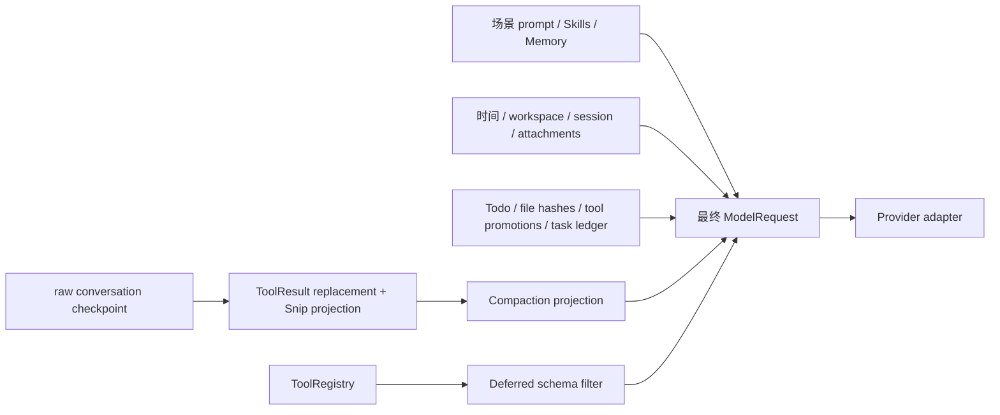

# Noesis Agent Runtime 与上下文管理

> 状态：Current
>
> 代码基线：DeepAgents `0.6.12`、LangChain `1.3.15`、LangGraph `1.2.11`
>
> 变更设计：[`simplify-agent-context-architecture`](../../../openspec/changes/archive/2026-08-26-simplify-agent-context-architecture/design.md)

## 结论

Noesis 现在采用 DeepAgents 风格的直接装配：场景 Agent 把 `tools / backend / skills / memory / subagents / interrupt_on` 等参数交给唯一 factory，factory 一次生成 middleware stack，再调用 LangChain `create_agent()`。

上下文能力不是按“类越少越好”裁剪，而是按 owner 是否清楚划分：

- 8 个 Noesis middleware 实现 Claude Code 风格但上游缺失的策略；
- 2 个薄适配器继承 DeepAgents Skills/Memory，只补 freshness；
- Filesystem、SubAgent、Todo、PatchToolCalls、HITL 和 call limits 直接使用 DeepAgents/LangChain；
- tool registry、Provider 编码、SSE、持久化和真实文件 I/O 不伪装成 middleware。

`VersionedSkillsMiddleware` 已改名为 `RefreshingSkillsMiddleware`；`TurnMemoryMiddleware` 已改名为 `RefreshingMemoryMiddleware`。旧名称表达的是实现手段或生命周期片段，现名称直接表达能力。`capabilities/` 已删除，因为两个类本身就是 middleware，再增加一层只会让导入路径和阅读成本变高。

## 目录结构

```text
noesis/
├── factory.py
└── agents/
    ├── middlewares/
    │   ├── stack.py
    │   ├── dynamic_context_middleware.py
    │   ├── durable_context_middleware.py
    │   ├── tool_result_budget_middleware.py
    │   ├── tool_failure_middleware.py
    │   ├── read_before_write_middleware.py
    │   ├── deferred_tool_filter_middleware.py
    │   ├── compaction_middleware.py
    │   ├── snip_middleware.py
    │   ├── refreshing_skills_middleware.py
    │   └── refreshing_memory_middleware.py
    ├── runtime/
    │   └── tool_registry.py
    ├── backends/
    ├── prompts/
    └── ... 场景 Agent
```

依赖方向固定为 `scene → factory → agents.middlewares/runtime`。通用 middleware 不得反向导入 factory、Service 或具体场景 Agent。`agents.__init__` 保持 lazy 场景导出；循环依赖通过依赖方向解决，不通过把 middleware 移到顶层解决。

## 8 个 Noesis middleware

| Middleware | 实际功能 | Claude Code 对应逻辑 |
|---|---|---|
| `DynamicContextMiddleware` | 每次 run 解析一次时间、时区、workspace、session、附件清单，保存到 private state；每次 model call 重建同一 system block | 动态环境信息不写进历史，也不要求摘要记住；同一 run 内保持稳定 |
| `DurableContextMiddleware` | 从 Todo、Skills metadata、read hash、tool promotion 和 task messages 提取有界引用；压缩前后都从 private state 重建 | plan、任务、已加载 Skill、活动文件、已发现工具等属于摘要外的 durable context |
| `ToolResultBudgetMiddleware` | 对单条超大结果、同一批并行结果和旧 write/edit 大参数执行确定性 replacement；完整正文写 artifact，state 保存 path、synopsis、hash、tokens freed；resume 重放同一决定 | 工具输出与旧工具参数先局部减重，再考虑整段会话压缩；失败结果的 status/category/outcome 不丢失 |
| `ToolFailureMiddleware` | 把普通工具异常变成与原 call id 配对的 typed error `ToolMessage`；取消、HITL/Graph interrupt 继续抛出 | 工具失败仍保持合法 tool-call/result 序列，控制流异常不能被当成业务错误吞掉 |
| `ReadBeforeWriteMiddleware` | read 前后读取 backend 并记录稳定内容 hash；write/edit 前重读校验并原子消费 hash；失败写入恢复 claim | 文件修改必须基于当前已读版本，避免使用过期上下文覆盖用户修改 |
| `DeferredToolFilterMiddleware` | model call 只暴露基础工具与当前 catalog hash 下已发现的 schema；执行时再次检查 promotion 和权限 | 大 MCP/tool catalog 不全量占用 prompt，通过 ToolSearch 按需加载 schema |
| `CompactionMiddleware` | 最终 request 预算、自动压缩、summary PTL retry、reactive overflow 重试一次、breaker、manual compact、raw history projection 和 archive | Claude Code 式多阶段长上下文压缩；失败摘要不能替换原历史 |
| `SnipMiddleware` | 通过显式 selector 把旧消息范围替换为 marker；记录 hash/tokens；不删除 raw transcript，不切断 tool pair、当前 turn 或 compact boundary | 定点清理 effective history，而不是整段摘要或物理删消息 |

所有 Noesis private state 都通过 `state_schema + PrivateStateAttr` 声明，因此 LangChain `create_agent()` 能合并 schema，也不会把内部 ledger 当成普通 Agent 输出。此前 `SubAgentContextMiddleware` 缺少基类 hook 的报错，本质就是它没有正确继承/声明 LangChain middleware 契约；该类现已删除，子 Agent 直接使用 DeepAgents `SubAgentMiddleware(private_state_keys=...)`。

## 2 个 DeepAgents 薄适配器

| Adapter | 基类 | 只补什么 |
|---|---|---|
| `RefreshingSkillsMiddleware` | `SkillsMiddleware` | 每个顶层 run 比较用户 Skills revision。revision 未变直接使用 checkpoint cache；变化时只清理上游 `skills_metadata/skills_load_errors`，再调用上游 loader |
| `RefreshingMemoryMiddleware` | `MemoryMiddleware` | 每个顶层 run 清理 `memory_contents` 并调用上游 loader；同一 run 内固定，不在每次 model call 重读文件 |

此前为什么会出现 `VersionedSkillsMiddleware` 和 `TurnMemoryMiddleware`：DeepAgents 的默认 cache 对长寿命 checkpoint 来说不会自动知道外部 Skills/Memory 已变化。Skills 已有 revision，所以用版本判断；Memory 当时没有可靠 revision，只能按 turn 刷新。这个需求仍然存在，只是无需放在 `capabilities/`，也无需建立统一 `SourceRefreshMiddleware`。

## 直接采用的上游 middleware

| 来源 | Middleware | Noesis 用途 |
|---|---|---|
| DeepAgents | `FilesystemMiddleware` | workspace 文件工具与 artifact 能力 |
| DeepAgents | `SubAgentMiddleware` / `AsyncSubAgentMiddleware` | 子 Agent 编译、task 工具、调度与结果回传 |
| DeepAgents | `PatchToolCallsMiddleware` | 修复中断/恢复后悬空的 tool call |
| LangChain | `TodoListMiddleware` | Todo 状态与工具 |
| LangChain | `ModelCallLimitMiddleware` / `ToolCallLimitMiddleware` | 显式配置的调用次数限制 |
| LangChain | `HumanInTheLoopMiddleware` | 高风险工具审批 |

不复制这些类，也不在 Noesis 中创建只转发构造参数的 wrapper。

## 不再作为 middleware 的能力

| 旧类/概念 | 处理结果 | 当前 owner |
|---|---|---|
| `SourceRefreshMiddleware` | 删除 | Skills、Memory、tool catalog、attachments 各自管理 freshness |
| `MicroCompactionMiddleware` | 删除 | tool-result 局部减重归 ToolResultBudget；conversation reduction 归 Compaction |
| `SafeModelRetryMiddleware` | 删除 | 瞬时传输 retry 归 Provider SDK；context overflow 归 Compaction |
| `SubAgentContextMiddleware` | 删除 | DeepAgents SubAgent + `private_state_keys` 负责默认隔离；编译/调度不再包一层 middleware |
| `ToolCatalogMiddleware` | 拆分并改名 | catalog、revision、权限、`tool_search` 归 `agents/runtime/tool_registry.py`；model/tool hook 只留 DeferredToolFilter |
| `FileContextMiddleware` | 收窄并改名 | 只保留 ReadBeforeWrite hash gate；不维护第二套文件 LRU/excerpt cache |
| RuntimeTelemetry/usage/SSE | 移出 | stream bridge、trace 与 Service |
| Provider canonical encoding/cache | 移出 | LangChain Provider adapter/SDK |

DeerFlow middleware 数量更多，主要因为它还把 uploads、sandbox、title、token usage、terminal、safety、MCP routing 等平台能力放在 middleware 目录。Noesis 没有删除这些产品能力，但按真实 lifecycle 放到 attachment resolver、backend、runtime registry、stream 或 Service。只有需要拦截 `before_agent / model call / tool call` 且需要参与 Agent state 的逻辑才留在 middleware。

## 实际装配顺序

完整 Profile 的 outer-to-inner 顺序：

```text
ToolResultBudget                 Noesis
→ ToolFailure                   Noesis
→ ReadBeforeWrite               Noesis，可选 backend
→ TodoList                      LangChain，可选
→ RefreshingSkills              DeepAgents 薄适配，可选
→ Filesystem                    DeepAgents，可选
→ SubAgent / AsyncSubAgent      DeepAgents，可选
→ RefreshingMemory              DeepAgents 薄适配，可选
→ DynamicContext                Noesis
→ DurableContext                Noesis，Super/Fault
→ Snip                          Noesis，可选
→ DeferredToolFilter            Noesis，可选
→ PatchToolCalls                DeepAgents
→ Compaction                    Noesis，配置开启时
→ ModelCallLimit / ToolCallLimit LangChain，可选
→ HumanInTheLoop                LangChain，可选
→ Provider
```

这里的顺序是行为约束：ToolResultBudget 位于 ToolFailure 外层，才能限制 error result；ReadBeforeWrite 位于 Filesystem 外层，才能在实际工具执行前后校验；稳定上下文与 tool filtering 位于 Compaction 外层，预算才能看到最终 request；HITL 保持最内层工具门禁。

`COMMON_QA` 的最小 stack 是：

```text
ToolResultBudget → ToolFailure → DynamicContext → PatchToolCalls → Compaction
```

Compaction 配置关闭时只省略 Compaction，不改变其他相对顺序。

## 上下文数据流



raw transcript 不因 ToolResult replacement、Snip 或 Compaction 被物理删除。送给 Provider 的 effective history 由 checkpointed private record 重建。这样 resume 可重放同一决策，摘要或 archive 失败时也不会丢失原始会话。

## 命令层

命令层（`noesis/chat/commands/`）是跨通道的斜杠命令子系统，与 middleware 解耦：

- **注册与分发**：`@command(name, description, channels=None)` 装饰器写一次逻辑，`dispatch(InboundMessage)` 在进 Agent 前统一分发。命令解析只在 `InboundMessage.command_name()` 做一次，任何 adapter 不自行解析。
- **包边界**：handler 位于 `noesis.chat` 包，SHALL NOT 直接 import `noesis.services`/`noesis.agents`。需要触达 service 层（如 run_manager、建新会话）时，由 server wiring 在启动时通过 `runtime.py` 的 `set_*_provider` 注入；未注入则降级。这样命令层对 DB/Service 零硬依赖，CLI 等轻量环境也能加载。
- **通道过滤**：`channels` 参数限定命令在哪些 `channel_type` 可用。声明 channels 后，其余通道 `dispatch` 命中时返回 `handled=False` 放行（当普通文本进 Agent），命令发现（`list_command_descriptions(channel=...)`）也不返回它。默认 `channels=None` 表示全通道可用（保持现有命令行为）。

`/new` 是通道差异化的典型：对齐 Claude Code `/clear` 与 hermes gateway `/new` 的"换新 session 从头开始、旧 session 保留可追溯"模型，但适配多通道——Web 已有「新对话」按钮（命令入口冗余），故 `/new` 声明 `channels=("telegram","feishu")` 仅在无 UI 通道暴露。命中后通过注入的 session_factory 建新 session，并 `channel_bindings.put()` 重绑该 chat 的 binding 到新 session，旧 session 不软删。

## 当前边界

- 子 Agent 已通过 DeepAgents `private_state_keys` 隔离 Noesis 的 dynamic/durable/file/tool-result/tool-catalog/snip/compaction state。显式 fork/resume policy 属于后续 subagent state-builder 工作，不应重新做成通用 middleware。
- Provider 最终的 Anthropic/OpenAI message 编码、prompt cache marker 与网络 retry 继续由 LangChain Provider adapter/SDK 管理；Noesis 不增加 `ContextCompiler`。
- `SnipMiddleware` 具备真实 `snip_context` tool，但默认不安装；只有产品提供明确入口时通过 `snip=True` 启用。
- Deferred tool schema 当前使用 Provider 无关的本地过滤；未来 Provider 暴露稳定的原生 deferred schema API 时，可在 Provider adapter 表达，不改变 registry 和 promotion state。

## 验证要求

修改 middleware 或 stack 后至少执行：

```bash
cd backend
uv run pytest \
  tests/test_*middleware.py \
  tests/test_tool_registry.py \
  tests/test_noesis_stack_assembly.py \
  tests/test_agent_runtime_factory.py -q
```

发布前还要验证 wheel 导入、各 Profile 创建、checkpoint resume、并行 tool results、summary PTL、Provider overflow、文件 stale、HITL interrupt 和 SSE/assistant persistence。middleware inventory 必须从实际实例生成，不维护第二份手写 allowlist。
