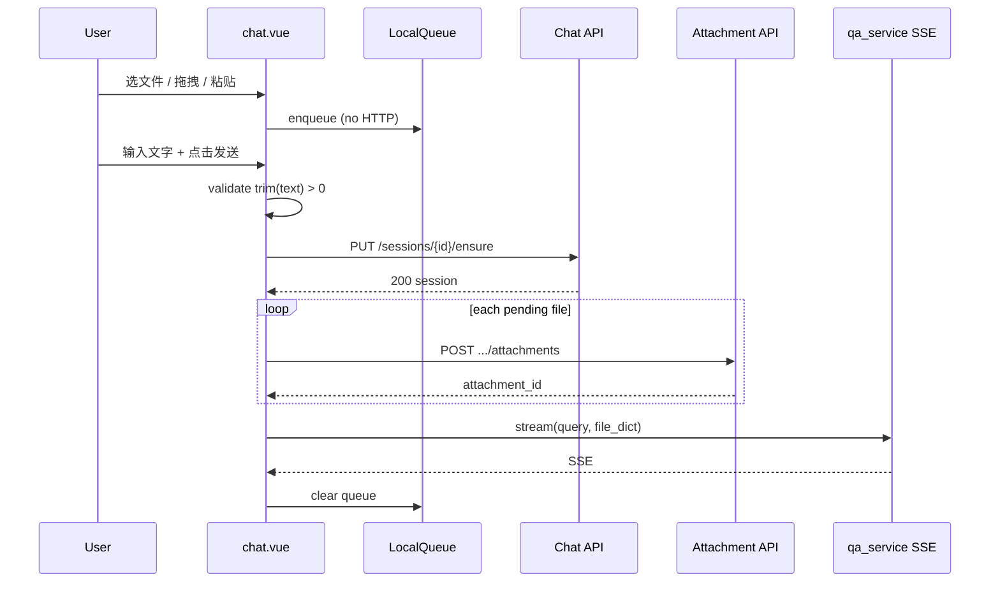

## Context

### 现状

| 层级 | 行为 | 问题 |
|------|------|------|
| 前端 Composer | 选文件 → 立即 `POST .../attachments` | 首对话 session 未入库 → 404 |
| 前端发送 | `handleCreateStylized` 直接 SSE | 假设附件已上传完成 |
| 后端 session | `qa_service.exec_query` 内 `get_or_create_session` | 仅首条消息触发 |
| 产品规则（已定） | 必须带文字才能发送；刷新丢弃 | 与方案 A 中间态不一致 |

### 约束

- 复用已有 `POST /api/chat/sessions/{session_id}/attachments` 与 `CHAT_ATTACHMENT_REF` 哨兵，不新增 SSE 事件。
- `FAULT_OPERATION_QA` 继续禁止附件（发送前拦截）。
- 当前附件以中小文档为主，发送时 **串行 upload** 可接受；不做发送前后台预上传。
- `chat.vue` 主路径 **不** 使用 `POST /api/chat/sessions`（服务端生成 ID）；继续 `uuids[qa_type]` client UUID。

---

## Goals / Non-Goals

**Goals:**

- 方案 B：附件仅在用户点击发送且通过校验后上传。
- 会话在发送编排第一步物化（`get_or_create_session`），与首条 user 消息同一事务语义。
- 发送按钮灰化规则明确、可测试。
- 刷新/新建对话丢弃未发送队列，无服务端孤儿附件。

**Non-Goals:**

- 发送前随时上传（方案 A）及 lazy 物化空会话。
- 刷新恢复草稿（sessionStorage / 服务端 draft session）。
- 混合方案（后台预上传 + 无文字不可发）。
- 修改 `TEST_CASE_QA` / `DEEP_RESEARCH_QA` 的 KB 上传路径（本 change 聚焦 `COMMON_QA` chat 附件）。

---

## Decisions

### D1：Composer 两阶段 — 本地队列 vs 服务端附件

**本地队列（发送前）**

```typescript
interface PendingComposerFile {
  id: string           // 客户端临时 id
  file: File
  name: string
  kind: 'document' | 'image'  // 由扩展名/mime 推断
  status: 'queued' | 'uploading' | 'failed'
  error?: string
}
```

- 拖拽 / 粘贴 / 选择文件 → 仅 `push` 到 `pendingComposerFiles`，**不** 调 HTTP。
- UI 用 `ObjectURL` 预览图片；文档展示文件名 + 图标。
- 移除队列项仅删本地，**无** DELETE API。

**发送时（服务端）**

```
1. validateSend()           // 文字、qa_type、故障运维等
2. get_or_create_session    // 后端：随 exec_query 或前置 ensure（见 D2）
3. for each pending file:
     POST .../attachments
     collect attachment_id → file_dict
4. POST stream / exec_query with file_dict + query
5. clear local queue + businessStore.file_list
```

串行 upload：实现简单，当前文件不大；失败则中止发送并保留输入与队列（已成功的可选回滚 DELETE，首版可仅标记 failed 由用户移除后重试）。

---

### D2：会话物化时机 — 仅首次发送

| 事件 | DB `t_chat_session` |
|------|---------------------|
| newChat / 默认页 | ❌ 仅 client UUID |
| 选文件 / 拖拽 | ❌ |
| **点击发送（通过校验）** | ✅ `get_or_create_session` |
| 刷新 | ❌ 丢弃 client 状态 |

**实现选项（推荐 2a）**

- **2a（推荐）**：发送编排先调 **`POST /api/chat/sessions/{id}/messages`** 或现有 stream 入口；stream 内已有 `get_or_create_session`，upload 步骤放在 **同一前端 async 函数内、调用 stream 之前**，并新增轻量 **`PUT /sessions/{id}/ensure`** 或在 send 前调用已有逻辑。

  实际上 stream 入口在 `exec_query` 里才物化，因此前端发送顺序应为：

  ```
  Option A front: 先 POST ensure session（若无 ensure API，则先 upload 会 404）
  ```

  **定稿**：新增 **`PUT /api/chat/sessions/{session_id}/ensure`**（幂等 `get_or_create_session`，body 含 `extra.qa_type`），发送编排 **第一步** 调用 ensure，**第二步** 串行 upload，**第三步** 调 SSE stream。

  备选：后端在 **batch upload** 新端点内物化 — 非首版，保持三 REST 调用清晰。

- **2b**：仅依赖 stream 内物化 — upload 必须在 stream 之前，故 **必须有 ensure** 或 upload API 内物化。产品已否决 upload 时物化，故 **ensure 端点或 send 编排内显式 create** 必选。

**Ensure API（新增）**

```
PUT /api/chat/sessions/{session_id}/ensure
Body: { "extra": { "qa_type": "COMMON_QA" }, "title": null }
Response: ChatSessionResponse
语义: get_or_create_session，title 缺省为默认标题
```

JWT + user_id 校验；幂等。

---

### D3：发送按钮启用 / 灰化

```typescript
sendDisabled =
  stylizingLoading
  || !inputText.trim()                    // 必须：有效文字
  || isUploadingOnSend                    // 发送编排 upload 进行中
  || faultOpWithFiles                     // FAULT_OPERATION + 有文件
  || tcPhaseBlocked                       // 其它 qa 既有条件
```

**明确不做**：仅有附件、无文字时启用发送。

加载中（`stylizingLoading`）点击为停止，保持现有行为。

---

### D4：刷新与 newChat 丢弃策略

| 动作 | 清空 |
|------|------|
| 刷新页面 | `inputText`、`pendingComposerFiles`、`businessStore.file_list` |
| `newChat()` | 同上 + 新 `uuids[qa_type]` |
| 切换历史会话 | 清空 pending 队列（防串会话） |

**不** 写 sessionStorage；**不** 在 unload 时调后端 DELETE。

---

### D5：drag / paste / 下拉上传入口

- 拖拽、粘贴图片、上传下拉 → 统一 **enqueue 本地队列**。
- `FAULT_OPERATION_QA`：enqueue 时即 toast 禁止，或隐藏上传入口（保留现有警告）。

---

### D6：与 `general-qa-file-upload` 的关系

| 项 | 原 change | 本 change |
|----|-----------|-----------|
| 附件 API | POST/GET/DELETE attachments | **保留** |
| file_dict 哨兵 | `__CHAT_ATTACHMENT__:<uuid>` | **保留** |
| Middleware / Agent | ChatAttachmentsMiddleware | **不变** |
| 上传时机 | 发送前 upload | **改为发送时 upload** |
| Session 先行 | 上传前 session 存在 | **ensure 于发送第一步** |

---

## 发送编排时序



---

## Risks / Trade-offs

| 风险 | 缓解 |
|------|------|
| 发送瞬间等待变长 | 当前文档不大；发送按钮 loading「上传中…」 |
| upload 部分成功 | 中止 stream；提示失败文件；保留文字与队列 |
| ensure 与 stream 重复物化 | 幂等 `get_or_create_session` |
| 旧 FileUploadManager 即时 upload | 本 change 重构为 `ComposerAttachmentQueue` 或改 mode |

---

## Migration Plan

1. 新增 `PUT /sessions/{id}/ensure` + 单测。
2. 前端本地队列 + 发送编排；灰化规则。
3. 移除 COMMON_QA 下选文件立即 upload；保留 KB mode 给非 COMMON_QA（若仍用 tmp）。
4. 回归：无附件发送、有附件发送、空格灰化、仅附件灰化、刷新丢弃、FAULT_OPERATION 拦截。

---

## Open Questions

- ~~上传时机~~ → **已决**：方案 B。
- ~~刷新~~ → **已决**：丢弃。
- ensure 独立端点 vs 合并进 batch upload：**首版独立 ensure**（实现清晰）。
