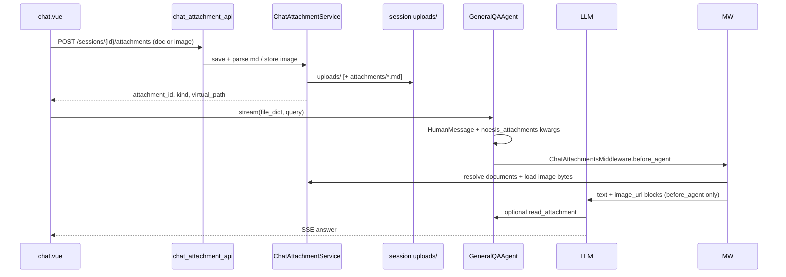

## Context

### 现状（代码审查结论）

| 层级 | 状态 | 说明 |
|------|------|------|
| 前端 UI | 部分实现 | `chat.vue` 挂载 `FileUploadManager`，各 `qa_type` 均可见上传入口 |
| 前端上传 | 走知识库 | `POST /api/knowledge_base/collections/tmp/upload`，写入 Qdrant `tmp` Collection |
| 前端发送 | 契约错误 | `file_dict: upload_file_list` 传 **数组**，后端 schema 为 `Dict[str, str]` |
| 后端持久化 | 已实现 | `qa_service` 将 `file_dict` 写入 user 消息 `extra` |
| 后端 Agent | **未实现** | `GeneralQAAgent.run_agent` 接收 `file_list` 但从未使用，仅 `HumanMessage(content=query)` |
| 参考实现 | TEST_CASE_QA | `case_coordinator.resolve_document_context` 从 `file_dict` 拉取 KB 正文并注入 workflow |

Gemini / Cursor 的核心体验：**会话级临时附件** + **模型可读正文** + **多轮可引用**，而非把用户文件永久写入企业向量库。

### 约束

- 复用 `kb/document_parse/DocumentParser`（MarkItDown）解析链；**首版不引入 Docling/OCR 第二套引擎**。
- API 层用 `ResponseUtil`；Service 层访问 DB/磁盘。
- 不新增 SSE 事件类型；附件消费在 Agent 输入侧完成。
- `FAULT_OPERATION_QA` 继续禁止上传（前端已有校验）。

---

## 调研结论与最佳实践

业界常见会话附件实践对比如下（详见 `docs/` 调研归档）。

| 实践维度 | 常见方案 A | 常见方案 B | **Noesis 采纳** |
|----------|-----------|------|-----------------|
| 存储位置 | 线程目录磁盘，不入向量库 | 线程目录 + DB 元数据，不入向量库 | ✅ 会话目录 + MySQL 元数据 |
| 原文件 vs 解析副本 | 保留原文件 + 可选 `.md` sibling | 保留原文件 + `attachments/*.md` | ✅ 双份落盘（原文件 + Markdown） |
| Agent 消费主路径 | Middleware 注入文件清单 + outline，**工具按需读** | 同步 LangGraph `uploads` state + 沙箱文件 | ✅ Middleware 式注入 + `read_attachment` 工具 |
| 全文内联 | ❌ 不默认内联全文 | 解析后写入 state 文件内容 | ⚠️ 仅**极小文件**（≤4KB）内联，其余走工具 |
| 多轮可见性 | 扫描线程 uploads 目录 + 本轮 metadata | DB 附件列表 + state 同步 | ✅ DB 索引 + 会话目录扫描 |
| 上传 API | POST / list / DELETE | POST / list / DELETE | ✅ 三端点齐备 |
| 文档解析 | MarkItDown；PDF 可选 pymupdf4llm；大文件异步 | Docling + OCR + 对象存储图 | ✅ MarkItDown；大文件 `asyncio.to_thread` |
| 解析安全默认 | `auto_convert` **默认关** | 聊天附件上传即解析 | ✅ 可配置；内网默认可开，保留开关 |
| 图片 | Agent 工具 + before_model | 上传 → base64 multimodal | ✅ **仅 `before_agent`** multimodal + 多轮重注入 |

### 提炼的设计原则

1. **会话附件 ≠ 知识库**：聊天上传不得调用 `QdrantService.upload_document` 或写入企业 Collection。
2. **工具优先、内联兜底**：默认向模型提供**文件清单 + 结构 outline + 读文件工具**，而非把 50 页 PDF 塞进 `HumanMessage`。
3. **原文件 + Markdown 副本**：解析成功则额外保存 `.md`，Agent 优先读 Markdown 路径。
4. **上传与发送解耦**：先上传拿到 `attachment_id` / 虚拟路径，发送消息时在 `extra.file_dict` 携带引用。
5. **多轮通过会话索引**：除本轮 `file_dict` 外，Agent 可访问同 `session_id` 下未过期历史附件（目录扫描 + DB 列表）。
6. **文档与图片统一附件管线**：同一 API、同一中间件；**COMMON_QA 中间件仅实现 `before_agent`**（不实现 `before_model` / `view_image`）。

---

## Goals / Non-Goals

**Goals:**

- 用户可在 `COMMON_QA` 上传**文档与图片**并就内容问答；体验对齐 Gemini/Cursor。
- 附件与会话绑定、TTL 清理；与 Qdrant 企业 Collection **完全解耦**。
- 统一 `file_dict: Dict[str, str]`；图片与文档共用 `attachment_id` 引用。
- **单一中间件** `ChatAttachmentsMiddleware`：**仅 `before_agent`**，负责文档清单 + 图片 multimodal。
- Agent 通过注入块 + `read_attachment` / `grep_attachment` 消费文档附件。
- 提供 upload / list / delete 完整附件生命周期 API。

**Non-Goals（本 change）:**

- `view_image` 工具、`before_model` hook、`viewed_images` state（留给 DEEP_RESEARCH 等沙箱 Agent，不在 COMMON_QA 实现）。
- Docling / MinIO 图片外链（知识库入库链路保持独立）。
- 附件跨会话/跨用户共享、自动入库企业知识库。
- 修改 `TEST_CASE_QA` / `DEEP_RESEARCH_QA` 的 `file_dict` 语义。

---

## Decisions

### D1：会话附件存储 — 会话目录 + MySQL 元数据

**目录布局**（权威存储，相对 `CHAT_ATTACHMENT_DIR`）：

```
sessions/{session_id}/
  uploads/              # 原文件（权威）
    需求说明.docx
  attachments/          # 解析成功的 Markdown 副本
    需求说明.md
```

**MySQL `t_chat_attachment`**（元数据索引，正文不进 BLOB）：

| 字段 | 说明 |
|------|------|
| `id` | UUID，`attachment_id` |
| `session_id` / `user_id` | 归属与鉴权 |
| `file_name` | 原始文件名 |
| `kind` | `document` \| `image` | 决定 Middleware 分支 |
| `original_path` | 磁盘原文件相对路径 | |
| `markdown_path` | 解析后的 `.md`（document 且 parsed 时有值） | |
| `mime_type` | 如 `image/png` | 图片必填 |
| `virtual_path` | Agent 工具逻辑路径 | |
| `char_count` | Markdown 字符数 |
| `status` | `uploaded` \| `parsed` \| `failed` |
| `created_at` / `expires_at` | TTL（默认 7 天） |

**理由**：线程目录优先、原文件 + markdown 副本 + DB 元数据；虚拟路径供工具层抽象，不暴露宿主机绝对路径。

**备选（已否决）**：扁平 `{attachment_id}.md` 单文件 → 丢失原文件、预览与 re-parse 能力；Qdrant tmp → 语义错误。

---

### D2：附件 API — 完整 CRUD 子资源

| 方法 | 路径 | 说明 |
|------|------|------|
| POST | `/api/chat/sessions/{session_id}/attachments` | multipart `file`；返回 `AttachmentResponse` |
| GET | `/api/chat/sessions/{session_id}/attachments` | 列出未过期附件 |
| DELETE | `/api/chat/sessions/{session_id}/attachments/{attachment_id}` | 删除原文件、markdown 副本与 DB 记录 |

**POST 流程**：

1. JWT + 校验用户拥有 `session_id`。
2. 文件名规范化（防目录遍历）。
3. 原文件写入 `uploads/`；大小 ≤ `CHAT_ATTACHMENT_MAX_FILE_MB`（默认 20MB）。
4. 若 `kind=document` 且 `CHAT_ATTACHMENT_AUTO_CONVERT=true`：`asyncio.to_thread(DocumentParser.convert_file_to_markdown, ...)` → `attachments/{stem}.md`。
5. 若 `kind=image`：校验 mime（`image/jpeg|png|webp|gif`），单文件 ≤ `CHAT_ATTACHMENT_MAX_IMAGE_MB`（默认 5MB）；可选生成缩略图 base64 缓存至 DB `preview_base64` 字段；**不**转 Markdown。
6. 写入 DB；返回 `{ attachment_id, file_name, kind, status, char_count, preview, virtual_path, artifact_url }`。

`artifact_url`：`GET /api/chat/sessions/{session_id}/artifacts/{relative_path}` 供前端预览（可选 Phase 1.1）。

**理由**：业界惯例提供 list/delete；仅 POST 不足以支撑附件管理与多轮 UI。

---

### D3：`file_dict` 契约（保留并与 TEST_CASE 哨兵对称）

```python
CHAT_ATTACHMENT_REF = "__CHAT_ATTACHMENT__"
# 示例: {"需求说明.docx": "__CHAT_ATTACHMENT__:<uuid>"}
```

`resolve_chat_attachments(file_dict, session_id, user_id)`：

- 哨兵值 → 按 id + session 加载元数据；**优先返回 `markdown_path` 内容**，无 md 则读原文件并尝试即时转换。
- 值长度 > 800 → 内联正文（兼容旧会话 / 测试数据）。
- 其它 → warning 并跳过。

发送时 `qa_service` 仍将 `file_dict` 写入 user 消息 `extra`（已有行为）。

---

### D4：`ChatAttachmentsMiddleware` — **仅 `before_agent`**（COMMON_QA）

**结论**：通用问答 Agent 用户上传驱动，**只需 `before_agent`**。不实现 `before_model` / `view_image`（深度研究 / 沙箱 Agent 另议）。

**挂载**：`create_noesis_agent(..., extra_middleware=[ChatAttachmentsMiddleware(...)])`，位于 capability 栈之后、runtime guards 之前。

**输入**（`run_agent` 写入 `HumanMessage.additional_kwargs`）：

```python
{
  "noesis_attachments": {
    "session_id": "...",
    "user_id": "...",
    "file_dict": {"photo.png": "__CHAT_ATTACHMENT__:<uuid>", ...},
  }
}
```

#### `before_agent` 行为（每轮用户消息执行一次）

| 附件 kind | 行为 |
|-----------|------|
| **document** | 合并本轮 `file_dict` + 会话历史文档 → `<uploaded_files>`（含 outline）；≤4KB 可全文内联 |
| **image**（本轮 `file_dict`） | Vision 可用 → 追加 `image_url` data URI 至 HumanMessage content list |
| **image**（历史，本轮未重传） | 若 `CHAT_ATTACHMENT_REINJECT_SESSION_IMAGES=true`（默认），将会话内未过期图片一并 multimodal 注入（上限 `MAX_IMAGES_PER_MESSAGE`，默认 3） |
| **image** + Vision 不可用 | `<uploaded_files>` 列出元数据 + 降级文案 |

Vision 判定：`CHAT_ATTACHMENT_VISION_ENABLED` + 当前 LLM 支持 Vision（如 Qwen-VL）。

**文档工具**（`GeneralQAAgent.tools`，非 Middleware）：
- `read_attachment(path, offset, limit)`
- `grep_attachment(pattern, path?)`

**HumanMessage 结构**（含图片时）：

```python
[
  {"type": "text", "text": "<uploaded_files>...</uploaded_files>\n\n{user_query}"},
  {"type": "image_url", "image_url": {"url": "data:image/png;base64,..."}},
  # 本轮 + 可选历史图片，至多 MAX_IMAGES_PER_MESSAGE 张
]
```

**系统提示词**（动态追加）：附件优先于知识库；大文档先 `read_attachment`；有图片且 Vision 可用时直接依据消息内图片回答。

**已否决**：
- `before_model` + `view_image` → 通用问答多一轮工具延迟，主路径不需要。
- `run_agent` 内联手写注入 → 与 `create_noesis_agent` 中间件栈不一致。

---

### D5：多轮附件可见性

- **本轮**：`file_dict` 附件标记为「本轮上传」。
- **历史文档**：`<uploaded_files>` 列出 + `read_attachment` 按需读取。
- **历史图片**：每轮 `before_agent` 按 `CHAT_ATTACHMENT_REINJECT_SESSION_IMAGES` 重注入 multimodal；超出 `MAX_IMAGES_PER_MESSAGE` 时仅列元数据。
- **过期**：list/read 过滤 `expires_at`；lazy delete 磁盘文件。

不在 COMMON_QA 首版引入 LangGraph checkpoint 级 `uploads` state 同步；Noesis 以 **DB + 目录** 为单一事实来源，降低与现有 `InMemorySaver` 的耦合。若后续 DEEP_RESEARCH 需要沙箱文件，再复用本模块虚拟路径。

---

### D6：解析流水线（复用 DocumentParser）

| 步骤 | 实现 |
|------|------|
| 入口 | `DocumentParser.convert_file_to_markdown(file_path)` 或 `parse_file` 取 `clean_markdown` |
| 支持类型 | 与现有 Parser 一致：doc/docx/pdf/txt/xlsx/csv/ppt/pptx/md |
| 大文件 | `size > 1MB` 时 `await asyncio.to_thread(...)` |
| 失败 | 原文件保留，`status=uploaded`；API 仍 200，响应 `status` 与 `parse_error` 字段；前端 warning |
| 空内容 | `status=failed`，HTTP 422 |
| PDF 扫描件 | 首版 MarkItDown 可能产出极短文本；响应 `preview` 过短时前端提示「可能为扫描件，回答或不完整」（后续可接 pymupdf4llm，不在本 change） |
| 安全 | `CHAT_ATTACHMENT_AUTO_CONVERT` 可关，关闭时仅存储原文件，Agent 通过工具读原文件路径（能力受 Parser 限制） |

**不引入** Docling/OCR/MinIO 图链路至聊天附件；知识库上传保持独立。

---

### D7：前端改造

1. `FileUploadManager`：`uploadMode='chat'`；**文档与图片均**调用 `POST .../attachments`（图片 accept `image/*`）。
2. store 存 `{ file_name, attachment_id, kind, virtual_path }`。
3. Session 先行；发送时 `file_dict` 统一哨兵引用（图片与文档相同格式）。
4. 用户气泡：文档用 `FileListItem`；图片用缩略图（`artifact_url` 或 upload 响应 `preview_base64`）。
5. `FAULT_OPERATION_QA` 继续拦截上传。

---

### D8：配置项（`ChatAttachmentConfig` in `config/env.py`）

| 键 | 默认 | 说明 |
|----|------|------|
| `CHAT_ATTACHMENT_ENABLED` | `true` | 总开关（回滚用） |
| `CHAT_ATTACHMENT_DIR` | `./data/chat_attachments` | 磁盘根 |
| `CHAT_ATTACHMENT_TTL_DAYS` | `7` | 过期天数 |
| `CHAT_ATTACHMENT_MAX_FILE_MB` | `20` | 单文件上限 |
| `CHAT_ATTACHMENT_MAX_COUNT_PER_SESSION` | `10` | 每会话附件数 |
| `CHAT_ATTACHMENT_AUTO_CONVERT` | `true` | 上传后自动转 Markdown |
| `CHAT_ATTACHMENT_MAX_IMAGE_MB` | `5` | 图片单文件上限 |
| `CHAT_ATTACHMENT_VISION_ENABLED` | `true` | multimodal 注入开关 |
| `CHAT_ATTACHMENT_REINJECT_SESSION_IMAGES` | `true` | 多轮是否重注入会话内历史图片 |
| `CHAT_ATTACHMENT_MAX_IMAGES_PER_MESSAGE` | `3` | 单条 HumanMessage 最多 image_url 块数 |
| `CHAT_ATTACHMENT_TINY_INLINE_CHARS` | `4096` | 极小文档全文内联阈值 |
| `CHAT_ATTACHMENT_READ_PAGE_LINES` | `2000` | `read_attachment` 默认 limit |

---

### D10：图片处理（仅 `before_agent`）

| 阶段 | 行为 |
|------|------|
| 上传 | 原图存 `uploads/`；可选 PIL 压缩 + DB `preview_base64` 供 UI |
| 本轮发送 | `before_agent` 将 `file_dict` 内图片注入 `image_url` |
| 多轮追问 | `before_agent` 按 D5 重注入会话图片（可配置关闭以省 token） |
| Vision 不可用 | 仅文本降级，不阻塞发送 |

**不实现**：`view_image`、`before_model`、聊天 OCR。

---

## 架构数据流



---

## Risks / Trade-offs

| 风险 | 缓解 |
|------|------|
| 模型不调用 `read_attachment` 瞎答 | 系统提示词强制「先读后答」；极小文件直接内联 |
| 扫描件 PDF 解析质量差 | 响应 `preview` 过短提示；后续 pymupdf4llm change |
| 磁盘占满 | TTL lazy delete + 每 session 数量上限 |
| 解析 CPU 阻塞 | `asyncio.to_thread` + 单文件大小 cap |
| 与 KB tmp 路径混淆 | COMMON_QA 仅走新 API；代码审查禁止 chat 路由调用 KB upload |
| 无 Vision 用户上传图片 | Middleware 降级文案 + 列出图片元数据；不阻塞发送 |

---

## Migration Plan

1. 建表 + 目录结构 + 三端点 API + `ChatAttachmentService`。
2. `ChatAttachmentsMiddleware`（仅 `before_agent`）+ `read_attachment` / `grep_attachment` + `GeneralQAAgent` 挂载。
3. 前端切换 upload 端点与 `file_dict` 序列化；移除 COMMON_QA 对 `collections/tmp` 的依赖。
4. 旧会话：`file_dict` 为数组或无效 → 解析为空，纯文本问答不受影响。
5. 回滚：`CHAT_ATTACHMENT_ENABLED=false`；前端隐藏上传入口。

---

## Open Questions

- ~~Hook 选择~~ → **已决**：COMMON_QA **仅 `before_agent`**；不实现 `before_model` / `view_image`（D4）。
- ~~一个 vs 两个 Middleware~~ → **已决**：单一 `ChatAttachmentsMiddleware`（D4）。
- `artifact` 预览端点是否纳入 Phase 1：建议 **纳入**（前端 `FileListItem` 可链接），实现成本低。
- TTL 清理：首版 **lazy delete**（list/upload 时触发），cron 可选。
