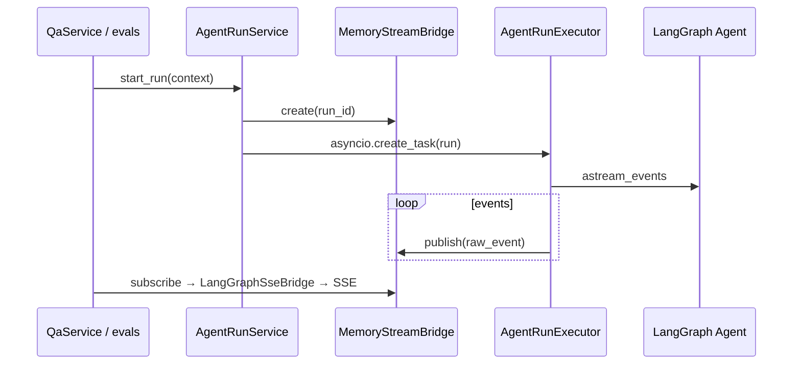

## Context

### 现状（Noesis）

```
POST /api/chat/sessions/stream
  → QaService.exec_query (qa_type 分支)
  → GeneralQAAgent / SuperAgent / FaultOperationAgent.run_agent()
  → create_noesis_agent + BaseAgent._stream_agent_response
  → LangGraphSseBridge → SSE + DB 落库

evals.agent.browsecomp / harbor/noesis_worker
  → SuperAgent 或 create_noesis_agent 直连（分叉）
```

- **已有资产**：`create_noesis_agent`（统一 factory）、`build_noesis_runtime_middleware`、`MemoryStreamBridge`（`domain/chat/streaming/bridge.py`）、`eval_runtime()`（内存 checkpointer）。
- **痛点**：四条 qa_type Agent 类重复 `run_agent` 样板；Harbor worker 自建 prompt/LLM/backend；评测与线上行为难以保证一致；`agent/` 与 `services/` 双向知识（sandbox、KB、附件）散落。

### 参考架构

| 项目 | Runtime | Harness / Platform |
|------|---------|-------------------|
| **deer-flow** | `packages/harness/deerflow/runtime/`（RunManager、StreamBridge、worker）、`agents/lead_agent`、`middlewares/` | `app/gateway/services.py`（`start_run`、SSE）、IM channels |
| **Yuxi** | `yuxi/agents/`（`BaseAgent`、`BaseContext`、`build_graph`） | `agent_run_service`、`run_worker`（ARQ）、`agent_runtime_service` |
| **deepagents** | PyPI 库：`create_deep_agent`、backends、middleware | 无产品层；Noesis 在其上叠加 factory |

**本 change 采纳**：deer-flow 的 **runtime 执行内核 + 嵌入式 Client**；Yuxi 的 **`BaseContext`  hydration + `agent_run_service` 接缝**；deepagents **保持依赖，不 vendoring**。

## Goals / Non-Goals

**Goals:**

- 建立清晰的 **Runtime ↔ Harness** 依赖方向：`noesis_runtime` 不得 import `services`、`api`、`domain/chat`（Langfuse 合并可保留在 runtime 边界 adapter）。
- 单一执行入口 `AgentRunService.start_run()`，供 `QaService`、`evals.agent`、Harbor、未来 CLI 共用。
- `AgentRuntimeContext` 承载一次 run 的全部配置，替代 scattered kwargs（`kb_collections`、`model_id`、`file_list`…）。
- Agent Profile 注册表：按 `qa_type` 解析 prompt/tools/middleware/backend 策略，而非四个独立 Agent 类各写一遍流式循环。
- 首版保持 **进程内 asyncio Task** + 现有 `MemoryStreamBridge`；为后续 deer-flow 式持久化 event journal 预留接口。

**Non-Goals:**

- 不发布独立 `noesis-harness` wheel（目录边界先行，拆包为 Phase 2）。
- 不引入 Redis/ARQ 后台 worker（Yuxi 全量模式留作后续 change）。
- 不实现 deer-flow 完整 `RunEventStore` / LangGraph Platform API 兼容。
- 不改变 SSE 事件类型、assistant 落库三阶段语义（见 `platform-chat`）。
- 不重构 `CaseCoordinator` StateGraph（测试用例 Agent 仍走专用图，仅共用 runtime 的 stream/cancel 原语）。

## Decisions

### D1. 模块布局（逻辑包，仍在 monorepo）

```
backend/
├── noesis_runtime/              # 新建：Agent 运行时（可未来抽 wheel）
│   ├── context.py               # AgentRuntimeContext + prepare_*()
│   ├── profiles/                # 按 qa_type 的 Profile 注册
│   │   ├── registry.py
│   │   ├── common_qa.py
│   │   ├── super_agent.py
│   │   └── fault_operation.py
│   ├── factory.py               # 自 agent/factory.py 迁入
│   ├── executor.py              # AgentRunExecutor：astream_events 循环
│   ├── run_service.py           # AgentRunService：start/cancel/subscribe
│   ├── client.py                # NoesisRuntimeClient（embed API）
│   ├── backends/                # 自 agent/backends/ 迁入
│   └── middlewares/             # 自 agent/middlewares/ 迁入
├── agent/                       # 过渡期薄兼容层（re-export + CaseCoordinator）
├── services/
│   └── agent_run_service.py     # Harness：DB/会话 + 调用 noesis_runtime
└── domain/chat/streaming/       # Harness：SSE 桥接（消费 runtime 事件）
```

**理由**：与 deer-flow `packages/harness` 同思路，但 Noesis 首版不增加 uv workspace 复杂度；通过 import lint（或 `noesis_runtime` 内禁止相对 import 上层）保证边界。

**备选**：物理拆 `backend/packages/noesis-runtime/` — 更清晰，但牵涉 uv path dep 与 Docker 构建；延后。

### D2. AgentRuntimeContext（对标 Yuxi BaseContext）

```python
@dataclass
class AgentRuntimeContext:
    qa_type: str
    thread_id: str          # = session_id / LangGraph thread_id
    user_id: str | None
    model_id: str | None
    query: str
    kb_collections: list[str]
    file_list: dict
    sandbox_enabled: bool
    # 运行时可变
    langfuse_session_id: str | None = None
```

- **`prepare_runtime_context()`**（Harness 层，`services/agent_runtime_service.py`）：从 `QaQueryRequest`、session `extra`、DB 解析 KB collections、附件、用户沙箱策略，填充 Context。
- **Profile `build_agent(context) -> CompiledGraph`**：读取 Context 决定 tools/backend/middleware；**不在 Context 内访问 DB**。

### D3. AgentRunService + Executor



- **`AgentRunExecutor`**：吸收 `BaseAgent._stream_agent_response`（cancel 标记、`__tw_finish__`/`__tw_error__` 哨兵、Langfuse config merge）。
- **`AgentRunService`**：维护 `running_tasks`（从 `BaseAgent` 迁入）、`cancel_run(thread_id)`；与 `StopTokenService` 集成留在 Harness（`QaService`）。
- **首版不持久化 run 表**；`run_id` 可用 `assistant_message_id` 或 `uuid` 仅作 bridge key。

**理由**：对齐 Yuxi「service 不 build graph，只管 run + 事件」；复用 Noesis 已有 `MemoryStreamBridge` 而非重写 deer-flow `StreamBridge`。

### D4. Agent Profile 注册表

| qa_type | Profile 模块 | 特殊逻辑 |
|---------|-------------|----------|
| `COMMON_QA` | `profiles/common_qa.py` | RAG tools、附件 middleware |
| `SUPER_AGENT_QA` | `profiles/super_agent.py` | sandbox backend、MemoryMiddleware、subagents |
| `FAULT_OPERATION_QA` | `profiles/fault_operation.py` | MCP tools、运维 subagent |
| `TEST_CASE_QA` | — | 仍用 `CaseCoordinator`；Executor 提供 `stream_state_graph()` 适配 |

`profiles/registry.py`：`resolve_profile(qa_type) -> AgentProfile`。

现有 `GeneralQAAgent` 等类 **deprecated**：保留 thin wrapper `run_agent()` → `NoesisRuntimeClient.stream(context)` 一个版本周期。

### D5. 评测统一路径

| 调用方 | 现状 | 目标 |
|--------|------|------|
| `evals/agent/_agent.py` | `SuperAgent().run_agent()` | `NoesisRuntimeClient.run(context)` |
| `harbor/noesis_worker.py` | 直连 `create_noesis_agent` | `NoesisRuntimeClient` + `ProxyHarborBackend` 注入 context |
| BrowseComp | `_agent.run_super_agent` | 同上，`qa_type=SUPER_AGENT_QA` |

Harbor 仍可 host 子进程（容器代理），但 worker 内 **SHALL** 调用 `noesis_runtime.client`，不再复制 factory 拼装。

**理由**：对齐 Yuxi `agent_eval_run_service`「评测走同一 run 路径」；满足 `agent-offline-eval` 长期可信度。

### D6. deepagents 边界

- `noesis_runtime/factory.py` 继续组合 `deepagents` middleware/backends。
- **禁止**在 `noesis_runtime` 内 import `services/sandbox_service`；sandbox 生命周期由 Harness 在 `prepare_runtime_context` 前调用 `ensure_user_sandbox()`，将 `BackendProtocol` 实例注入 Context 或 Profile builder。
- 参考 deepagents `profiles/harness` 思路：可在 `factory.py` 增加 model-specific middleware 微调，但不引入第二套 agent 框架。

### D7. 依赖规则（强制）

```
api → services → domain/chat → noesis_runtime
evals → noesis_runtime (via client)
noesis_runtime → config, llm, deepagents, common
noesis_runtime -X→ services, api, domain/chat
```

## Risks / Trade-offs

| 风险 | 缓解 |
|------|------|
| 大迁移触及所有 Agent 路径 | 分阶段：先抽 `executor` + `client`，再迁 factory/backends；保留 `agent/*` re-export |
| `CaseCoordinator` 与 ReAct Agent 执行模型不同 | Executor 抽象 `StreamSource` 协议；StateGraph 单独 adapter |
| Harbor 子进程仍需轻量启动 | `noesis_runtime.client` 支持 `checkpointer=MemorySaver` + 无 DB 的 `prepare_context_for_eval()` |
| 过度设计 RunManager | 首版仅进程内 Task + MemoryStreamBridge；接口预留 `subscribe(run_id, last_event_id)` |
| 与 `add-super-agent-user-memory` 冲突 | Profile 层合并 MemoryMiddleware；本 change 不重复 memory spec |

## Migration Plan

### Phase 1 — 内核抽取（本 change）

1. 创建 `noesis_runtime/`，迁入 `executor.py`、`context.py`、`run_service.py`、`client.py`。
2. `BaseAgent._stream_agent_response` → `AgentRunExecutor`；`BaseAgent` 委托 executor。
3. 新增 `services/agent_run_service.py`；`QaService` 一条 qa_type 先接入（建议 `COMMON_QA`）验证。
4. `evals/agent/_agent.py` 改接 `NoesisRuntimeClient`。
5. 单测：`test_agent_cancel_task_id`、新增 `test_runtime_executor.py`。

### Phase 2 — Profile 与全 qa_type（本 change 内尽量完成）

6. 引入 `profiles/registry.py`，迁移 `SuperAgent`、`FaultOperationAgent` 装配逻辑。
7. `harbor/noesis_worker.py` 改接 client。
8. 删除 Agent 类内重复 `run_agent` 主体，保留 deprecated wrapper。

### Phase 3 — 后续（非本 change）

- 物理拆 `packages/noesis-runtime` wheel。
- 可选 Redis event stream（Yuxi 模式）。
- deer-flow 式 `RunEventStore` + SSE `Last-Event-ID` 断线续传。

### 回滚

每阶段保持 `agent/factory.py` re-export；`QaService` 可用 feature flag `runtime.use_agent_run_service`（`config.yaml`）切回旧路径。

## Open Questions

- `TEST_CASE_QA` 是否在本 change 纳入 `AgentRunService`，还是 Phase 3 单独适配 StateGraph？
- Harbor worker 是否改为 in-process（去掉子进程）以简化 context 传递？当前倾向 **保留子进程**，仅统一 runtime API。
- `agent_run_service` 是否需要最小 `agent_runs` DB 表支持审计，还是继续仅用 chat message 行承载？
